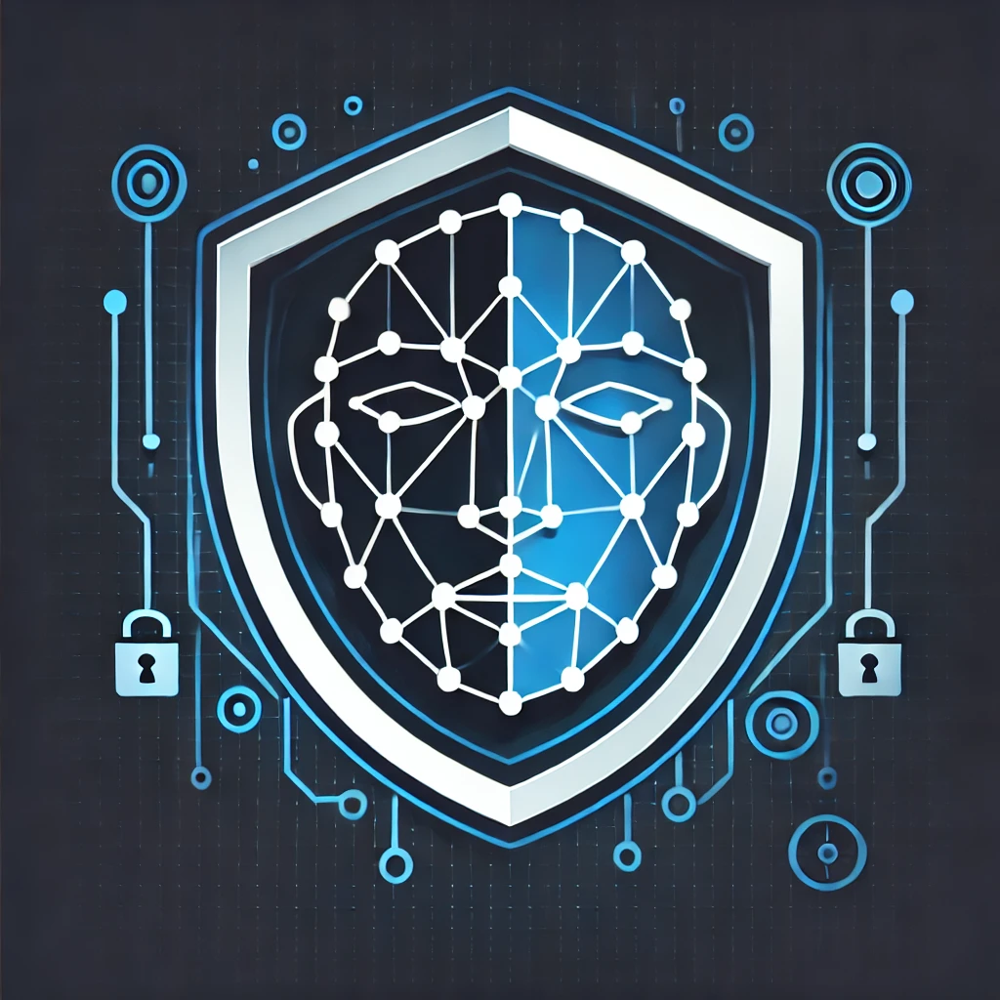
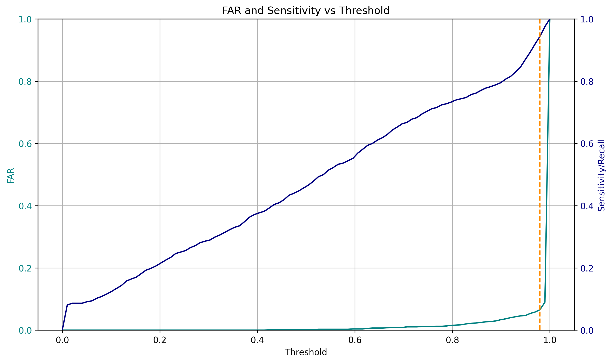
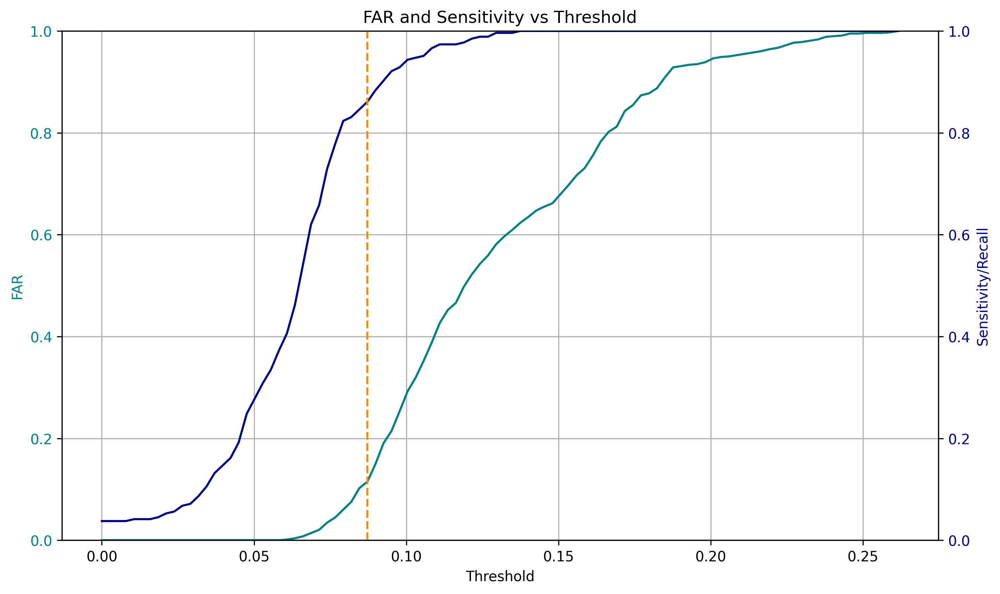

# Facial Identification and Spoofing Detection Project

  

This project focuses on facial identification and spoofing detection. No deep learning models were retrained for this project, as fine-tuning depends on the specific context of different datasets. Instead, we utilized existing high-performance models for the mentioned problems: [FaceNet](https://pypi.org/project/facenet-pytorch/) for face detection and embedding, and [Silent-Face-Anti-Spoofing](https://github.com/minivision-ai/Silent-Face-Anti-Spoofing) for spoofing detection.

## Project Overview

### Face Detection and Embedding

- **Model Used**: [FaceNet (facenet-torch)](https://pypi.org/project/facenet-pytorch/)
- **Components**: 
  - **MTCNN**: Used for face detection
  - **InceptionResnetV1**: Used for embedding faces

### Spoofing Detection

- **Model Used**: [Silent-Face-Anti-Spoofing](https://github.com/minivision-ai/Silent-Face-Anti-Spoofing)
- **Modifications**: 
  - Removed the face detection component from Silent-Face-Anti-Spoofing
  - Integrated face detection using MTCNN from FaceNet

### Code Organization

The original repositories' codes were partially absorbed into this repository. Numerous modifications were made to integrate the pipeline more effectively:

- **`facerecognition` Directory**: Contains codes related to FaceNet
- **`spoofing` Directory**: Contains codes related to spoofing detection

### Admin Tools

This project includes an admin directory with codes to assist in registering new faces into the identification database:

- **Face Registration**: 
  - **Script**: `Admin.ipynb`
  - **Process**: Simulated database processes for illustrative purposes and proof of concept
- **Comparison Script**: 
  - **One-to-Many Comparison**: Created to compare newly obtained embeddings with existing ones in the identification database using Bray-Curtis distance (parametrizable)

## Dataset Description

### MSU Mobile Face Spoofing Database (MFSD)

- **Total Videos**: 
  - 35 legitimate videos
  - 105 non-legitimate videos belonging to 37 distinct subjects
- **Selection for Evaluation**: 
  - 35 legitimate videos
  - 37 non-legitimate videos randomly chosen to maintain one video per subject
- **Usage**: 
  - **Spoofing Detection**: Used both legitimate and non-legitimate videos
  - **Face Identification**: Used only legitimate videos

For more information, refer to the [MSU Mobile Face Spoofing Database](https://paperswithcode.com/dataset/msu-mfsd).

## Security Analysis

### Spoofing Detection Evaluation

- **Notebook**: `Evaluate_spoofing.ipynb`
- **Evaluation**: 
  - Find the threshold that minimizes classification errors using FAR (False Acceptance Rate) and FRR (False Rejection Rate)
  - It's important to note that this threshold is commonly used to display results, but different consumer areas may prioritize different metrics and choose another operating point

#### Key Metrics

| Metric         | EER    | FAR    | FRR    | Best Threshold | AUC-ROC | Precision | Recall | F1-Score | Accuracy |
|----------------|--------|--------|--------|----------------|---------|-----------|--------|----------|----------|
| Value          | 0.0609 | 0.0658 | 0.0560 | 0.9798         | 0.9843  | 0.9351    | 0.9440 | 0.9395   | 0.9391   |

#### FAR and Recall vs. Threshold Plot

  

This plot illustrates the relationship between False Acceptance Rate (FAR) and Recall as the threshold varies for spoofing detection. The optimal threshold is selected to minimize the difference between FAR and FRR, thus balancing the rate of false acceptances and rejections.

### Face Identification Evaluation

- **Notebook**: `Evaluate_faceidentification.ipynb`
- **Process**: 
  - 10 legitimate clients registered using `Admin.ipynb`
  - 16 legitimate clients not registered
- **Data Used**: 
  - 36 legitimate videos
- **Evaluation**: 
  - Detect and embed faces from videos
  - Compare embeddings using Bray-Curtis distance
  - Verify identification correctness for each frame
  - Find the threshold that minimizes identification errors

#### Key Metrics

| Metric         | EER    | FAR    | FRR    | Best Threshold | AUC-ROC | Precision | Recall | F1-Score | Accuracy |
|----------------|--------|--------|--------|----------------|---------|-----------|--------|----------|----------|
| Value          | 0.1270 | 0.1149 | 0.1391 | 0.0872         | 0.9471  | 0.7179    | 0.8609 | 0.7829   | 0.8789   |

#### FAR and Recall vs. Threshold Plot

  

This plot demonstrates the variation of False Acceptance Rate (FAR) and Recall with changing thresholds in the context of face identification. The goal is to identify the threshold that minimizes the difference between FAR and FRR, optimizing the trade-off between identification accuracy and error rates.

## Integration and Demo

After selecting the optimal thresholds and ensuring full integration and connection of the pipeline codes, the final step was integrating everything into the `demo_video.py` script for real-time performance.

This project demonstrates a comprehensive approach to facial identification and spoofing detection, leveraging existing high-performance models and integrating them into a cohesive and functional pipeline.

Finally, demo videos were saved and are available in the `data/results/video/` folder.
